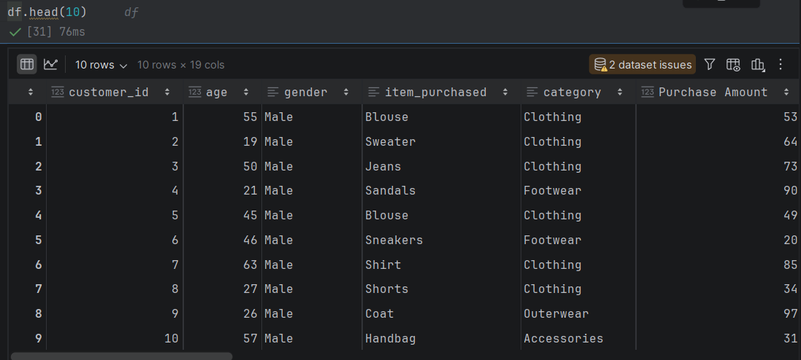
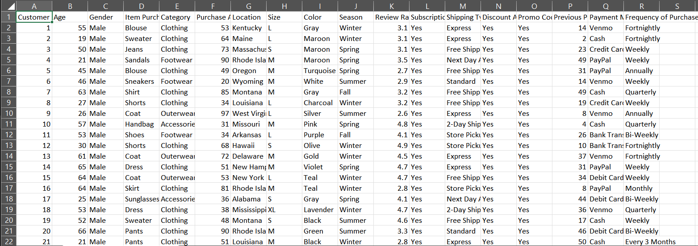
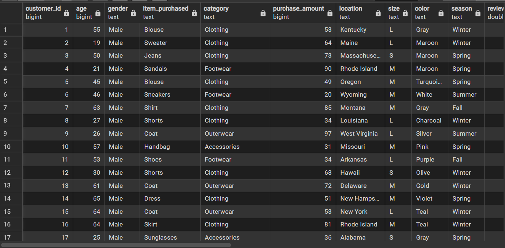
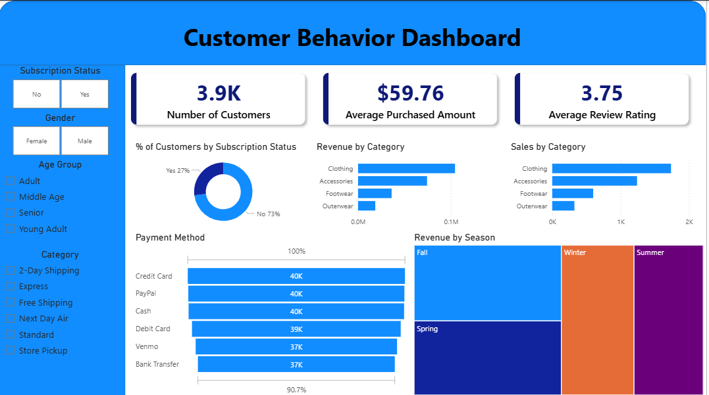

Customer Behavior Analytics Pipeline

This project is a full data analytics workflow where I took a raw CSV dataset and turned it into meaningful insights using different tools across the stack.

What I Used

CSV / Excel → initial data inspection and quick checks  
PostgreSQL → storing data and running queries  
Python (Pandas, Jupyter Notebook) → cleaning, exploring, and transforming data  
Power BI → building a dashboard and visualizing insights  

---

 What I Did

I didn’t just jump into dashboards. I went step by step:

 1. Data Exploration (CSV / Excel)
- Opened the dataset to understand structure
- Looked at columns like age, gender, category, purchase amount, etc.
- Checked for obvious issues (formatting, missing values)

 2. Data Processing (Python - Pandas)
- Loaded the dataset into Pandas
- Cleaned and formatted columns
- Explored patterns (categories, spending, ratings)
- Verified data consistency before moving forward

 3. Data Storage + Querying (PostgreSQL)
- Created a table and imported the dataset
- Ran SQL queries to:
  - Aggregate revenue by category
  - Analyze customer behavior
  - Break down patterns by season and payment method

 4. Dashboard (Power BI)
Built an interactive dashboard showing:
- Total customers
- Average purchase amount
- Average review rating
- Revenue by category
- Sales distribution
- Subscription breakdown
- Payment method trends
- Seasonal revenue

---

 What I Found (My Take)

- **Clothing dominates everything** — highest revenue and sales, not even close  
- **Subscriptions matter** — a big chunk of customers are subscribed, which likely drives repeat purchases  
- **Payment methods are spread out** — no single method dominates hard (credit card, PayPal, cash are all strong)  
- **Seasonality is real** — revenue shifts depending on the season, not flat  
- **Ratings are decent but not amazing (~3.7 avg)** — suggests customers are okay, not impressed  

---

Why I Made This

I wanted to practice a *real workflow*, not just isolated tools.  
Most tutorials stop at one tool — I connected everything:

CSV → Python → SQL → Dashboard
